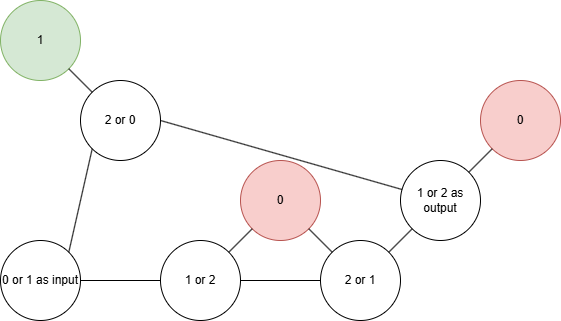
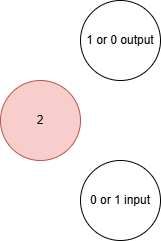

# lib/binary_logic

This directory contains the fundamental binary logic operations for the NP-Computer system. These operations are implemented using 3-coloring graph constraints rather than traditional digital logic gates.

## Fundamental Building Blocks

### NOT.py ⭐
**The most basic operation** - implements logical negation through graph connectivity:
- **Mechanism**: Creates a result node and connects it to the input node
- **Constraint**: Input and output cannot have the same color (value)
- **Result**: If input is 0, output must be 1; if input is 1, output must be 0
- **Special feature**: Can operate between different tri-state domains using the `between` parameter



```python
# Basic NOT: 0 → 1, 1 → 0
result = NOT(computer, input_node)

# Advanced NOT: Map to different tri-state levels
result = NOT(computer, input_node, between={TriBit.ONE, TriBit.X})
```

### SWAP.py ⭐
**The tri-state transformation engine** - enables complex logic transformations:
- **Purpose**: Maps between different combinations of tri-state values (see picture below for example)
- **Mechanism**: Uses a dual-branch circuit to remap input possibilities
- **Constraint**: `from_poss[1]` must equal `to_poss[0]` for current implementation
- **Applications**: Essential for building complex gates and execution control


```python
# Default: 0→1, 1→X
result = SWAP(computer, input_node, 
              from_poss=[TriBit.ZERO, TriBit.ONE], 
              to_poss=[TriBit.ONE, TriBit.X])
```

**SWAP Circuit Architecture:**
- **Top branch**: Handles the first mapping transformation
- **Bottom branch**: Uses double negation for the second mapping
- **Output**: Combines both branches to produce the correct mapping

### AND.py ⭐
**The most complex fundamental gate** - implements logical AND through constraint composition:
- **Architecture**: Three restriction stages followed by a filter 
    - **Step 1**: Uses multiple SWAP and NOT operations modify input for restrictions
    - **Step 2: Restrictions for the FILTER_INPUT node **:
        1. Don't allow 0 FILTER_INPUT unless both inputs are 1
        2. Don't allow 1 FILTER_INPUT when the inputs are both not 0
        3. Don't allow X FILTER_INPUT when the inputs are different


    - **Step 3: Filter**: Transforms the restriction results into proper AND output





```python
# Standard AND operation
result = AND(computer, input_a, input_b)
```

**AND Truth Table Implementation:**
- 0 ∧ 0 = 0 ✓
- 0 ∧ 1 = 0 ✓  
- 1 ∧ 0 = 0 ✓
- 1 ∧ 1 = 1 ✓

## Derived Operations

### NAND.py
**Universal gate** - NOT of AND operation:
```python
def NAND(computer, x_id, y_id):
    return NOT(computer, AND(computer, x_id, y_id))
```

### OR.py  
**Logical OR** - implemented using De Morgan's law:
```python
def OR(computer, x_id, y_id):
    return NAND(computer, NOT(computer, x_id), NOT(computer, y_id))
```

### NOR.py
**Logical NOR** - NOT of OR operation:
```python
def NOR(computer, x_id, y_id):
    return AND(computer, NOT(computer, x_id), NOT(computer, y_id))
```

### XOR.py
**Exclusive OR** - different inputs produce 1:
```python
def XOR(computer, x_id, y_id):
    return AND(computer, OR(computer, x_id, y_id), NAND(computer, x_id, y_id))
```

### XNOR.py
**Exclusive NOR** - same inputs produce 1:
```python
def XNOR(computer, x_id, y_id):
    return NAND(computer, OR(computer, x_id, y_id), NAND(computer, x_id, y_id))
```

## Architecture Principles

### Constraint-Based Logic
Unlike traditional digital circuits, these operations work by:
1. **Graph Connectivity**: Logic constraints are enforced through node connections
2. **Color Propagation**: The 3-coloring algorithm determines valid outputs

### Tri-State Foundation
The system leverages three fundamental states:
- **0 (ZERO)**: Traditional false/low
- **1 (ONE)**: Traditional true/high  
- **X**: Special state for advanced operations and transformations

### Hierarchical Construction
- **Level 1**: NOT, SWAP (primitive operations)
- **Level 2**: AND (complex constraint composition)
- **Level 3**: All other gates (combinations of Level 1 & 2)

## Implementation Notes

### Graph Colorability
All operations preserve 3-colorability when inputs are valid:
- Invalid inputs lead to undefined behavior
- This property enables the BREAK/FIND paradigm in execution control

## Theoretical Significance

These operations demonstrate:
1. **Functional Completeness**: Any boolean function can be implemented
2. **NP-Completeness**: Complex logic reduces to 3-coloring problems
3. **Constraint Satisfaction**: Logic emerges from graph properties rather than sequential computation
4. **Non-Deterministic Evaluation**: All paths are simultaneously explored through constraint propagation