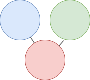

# lib/run

This directory contains the core runtime components for the NP-Computer system, which implements 3-coloring based computation.

## Files

### INIT.py
The main initialization module containing the `NPComputer` class. This is the core computational engine that:
- Manages a NetworkX graph for 3-coloring computations
- Provides node generation with constraint management
- Implements the fundamental tri-state logic (0, 1, X this is set according to the below picture)
- Handles graph colorability checking



### FINALS.py
Contains fundamental constants and enumerations:
- `TriBit` enum defining the three possible states (ZERO, ONE, X)
- `TRI_BIT_TO_NODE` mapping for guaranteed node values
- `DEFAULT_INT_BIT_LENGTH` constant

### IS_COLORABLE.py
Graph coloring algorithm implementation:
- 3-colorability checking with backtracking and constraint propagation
- Optimized algorithms for determining if a graph can be colored with 3 colors
- Visualization capabilities for graph coloring results

### MEM.py
Base memory abstraction class:
- Provides common memory operations (splitting, merging)
- Serves as the foundation for other memory-based classes
- Implements bit manipulation utilities

### CONST.py
Constant value implementation:
- Represents n-bit constants with fixed values at each bit
- Inherits from MEM for memory operations
- Handles binary representation and constraint enforcement

### VAR.py
Variable implementation:
- Represents n-bit variables that can take any value
- Inherits from MEM for memory operations
- Provides unconstrained bit generation
- Useful for creating logic off of this that will use BREAK logic under certain conditions
    - The BREAK logic makes the graph no longer 3-colorable
    - This allows mass searching of possible configurations without the need for FOR loops

## Usage

```python
from lib.run.INIT import NPComputer
from lib.run.VAR import VAR
from lib.run.CONST import CONST

# Create a computer instance
computer = NPComputer()

# Create an 8-bit variable
var = VAR(computer, n=8)

# Create an 8-bit constant with value 42
const = CONST(computer, value=42, n=8)

# Check if the computation is valid (3-colorable)
result = computer()
```

## Architecture

The system is built around the concept of 3-coloring, where:
- Each bit/node can be in one of three states: 0, 1, or X (unknown)
- Constraints are enforced through graph connectivity
- The final computation is valid if and only if the graph remains 3-colorable